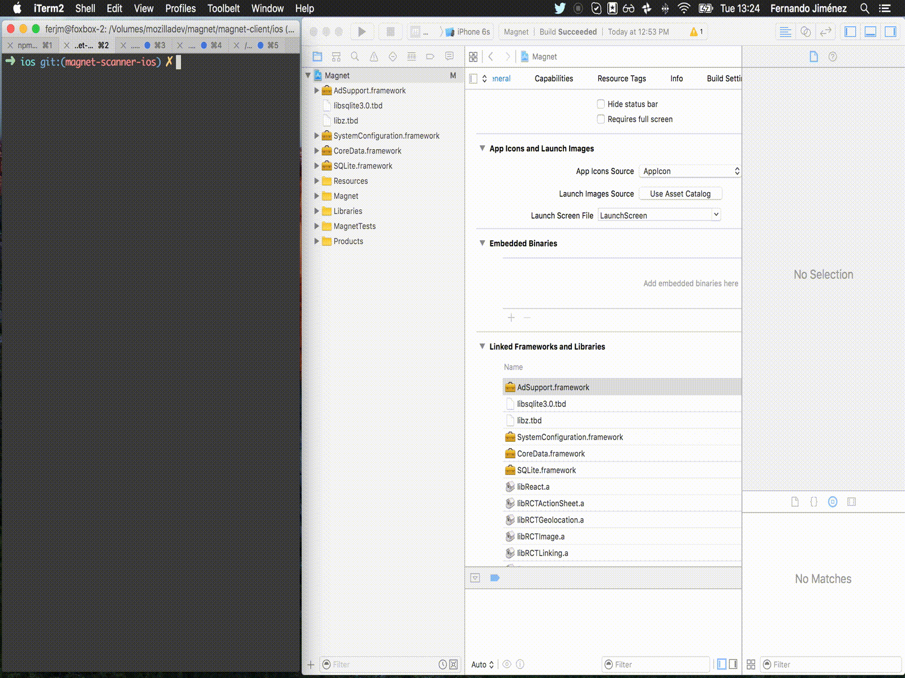
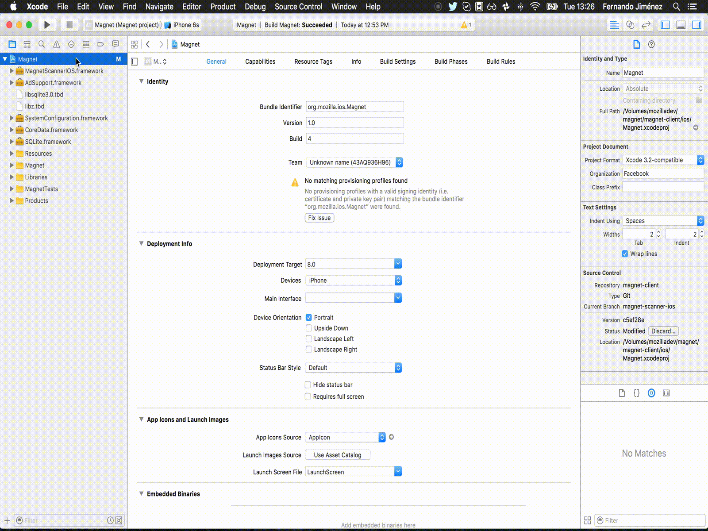

# magnet-scanner-ios
[](https://raw.githubusercontent.com/fxbox/foxbox/master/LICENSE)
[](https://github.com/Carthage/Carthage)

This is an iOS library that you can use in your projects to discover physical web objects around you.

Currently discovers urls based on the following protocols:

* Bluetooth Low Energy: Discovering both Eddystone and UriBeacon beacons.
* mDNS: urls advertised via this protocol.

# Usage
```swift
import Foundation
import MagnetScannerIOS

@objc(MagnetScannerClient)
class MagnetScannerClient: NSObject {
  var scanner: MagnetScanner!;

  override init() {
    super.init();
    scanner = MagnetScanner(callback: onItemFound);
  }

  @objc func start() -> Void {
    scanner.start();
  }

  func onItemFound(item: Dictionary<String, AnyObject>) {
    debugPrint("Item found!");
    scanner.stop();
  }
}
```
# Installation
## Carthage
[Carthage][] is a simple, decentralized dependency manager for Cocoa. To
install `magnet-scanner-ios` with Carthage:

 1. Make sure Carthage is [installed][Carthage Installation].

 2. Update your Cartfile to include the following:

    ```
    github "mozilla-magnet/magnet-scanner-ios" ~> 0.1.0
    ```

 3. Run `carthage update --platform iOS`

 4. This is where things start to really differ from CocoaPods. With Carthage,
 you need to manually drag the frameworks over to Xcode. Open your project in
 Xcode and go to `Linked Frameworks and Libraries` subsection in the `General`
 section of your projects settings. Now open the `Carthage` folder in Finder and
 drag the framework in the `Build/iOS` folder over to Xcode as seen in this GIF:

 

 5. Now your Swift code can see these frameworks, but we need to make sure the
device that the app is running on has them as well.

    * In your project settings, navigate to the `Build Phases`.

    * Add a `New Copy Files Phase`.

    * Go down to the `Copy Files` section.

    * Under `Destination` select `Frameworks`.

    * Add the `MagnetScannerIOS` framework as seen in this GIF:



[Carthage]: https://github.com/Carthage/Carthage
[Carthage Installation]: https://github.com/Carthage/Carthage#installing-carthage
